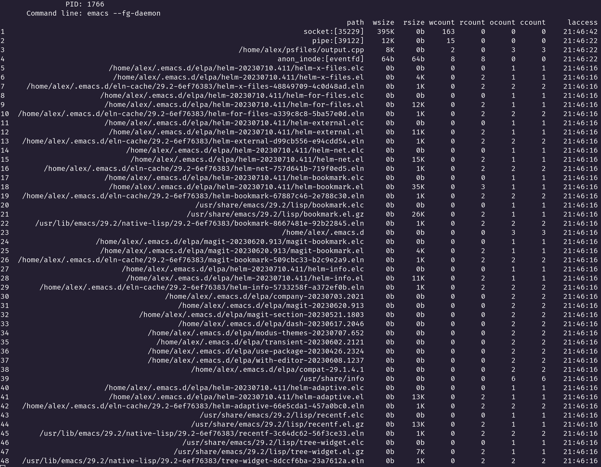

# What is this?

**Psfiles** is a simple utility to view file I/O activity of Linux processes.
Only regular *read(v)*, *write(v)*, *open(at)*, *close* syscalls are traced.
If the file has been memory mapped, this utility will not show the number of bytes read or written.

# Features

* start new process or attach to existing and trace it file I/O activity
* output results to standard output or save results to file
* custom results sorting

# Options

* **[--output, -o]:** path to output file. Default: *stdout*.
* **[--delay, -d]:** interval (seconds) between file list updates. Default: *1*.
* **[--sort, -s]:** column name for sorting results (append "-" to column name to sorting in descending order). Default: *path*.
* **--pid, -p:** attach to existing process with specified *pid*.
* **--cmdline, -c:** spawn new process with specified *cmdline*. Incompatible with **--pid** option. It should be the last option.

# Columns
* **path** - path to file,
* **wsize** - write size in bytes,
* **rsize** - read size in bytes,
* **wcount** - write/writev syscalls count,
* **rcount** - read/readv syscalls count,
* **ocount** - open/openat/creat syscalls count,
* **ccount** - close syscalls count,
* **mm** - indicates whether mmap was called for this file,
* **laccess** - time of the last system call listed above.

# Usage examples

Start new process, sort descending by write size, output to file, update output every minute:
* <code>psfiles -d 60 -s wsize- -o output.txt -c emacs /home/user/cpp/main.cpp</code>

Attach to existing process, sort by path, output to stdout, update output every second:
* <code>psfiles -p $(pidof emacs)</code>

# Control

If **--output** option was not specified, keyboard control is available:

* **1 - 9:** sort by specified column (1 - path, 2 - wsize, etc)
* **s:** toggle sorting order
* **n:** show next page (scroll down)
* **p:** show previous page (scroll up)
* **q:** quit

# Screenshot

# How to build?

* <code>git clone https://github.com/mukovnin/psfiles</code>
* <code>cd psfiles</code>
* <code>cmake . -B build</code>
* <code>cd build</code>
* <code>make</code>
* if needed, run <code>make install</code>
